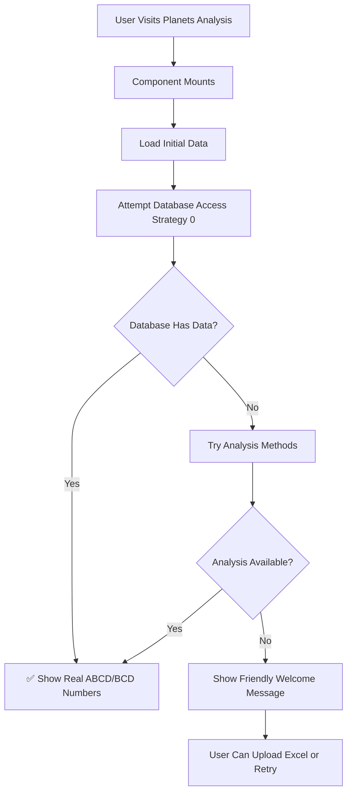

# 🎯 PLANETS ANALYSIS EXCEL UPLOAD REQUIREMENTS REMOVAL - COMPLETE

## 📋 SUMMARY

Successfully removed the logic requiring Excel upload and 4+ consecutive dates for accessing real ABCD/BCD data in the Planets Analysis page. The system now prioritizes direct database access and provides a much more user-friendly experience.

## ✅ CHANGES IMPLEMENTED

### 1. **PlanetsAnalysisDataService.js Improvements**

#### **Removed 4+ Dates Requirement**
- **Before**: Required `datesList.length < 4` check, returned error
- **After**: Works with any number of dates (including zero)
- **Impact**: Users can access real data without needing multiple dates

#### **Added Direct Database Access (Strategy 0)**
- **Added**: `AbcdBcdDatabaseService` import and database-first approach
- **Priority**: Database access attempted BEFORE any analysis methods
- **Fallback**: Only tries analysis methods if database is empty
- **Result**: Real ABCD/BCD data loads immediately when available

#### **Enhanced Fallback Analysis**
- **Before**: Required minimum 3 dates for fallback (changed from `i >= 3`)
- **After**: Reduced to minimum 1 date (`i >= 1`) for more flexible analysis
- **Impact**: System can work with very limited date data

#### **New Database Result Formatting**
- **Added**: `formatDatabaseResult()` method for consistent data formatting
- **Features**: Proper topic mapping, metadata, and timestamp handling
- **Compatibility**: Matches existing analysis result format

### 2. **PlanetsAnalysisPage.jsx UI Improvements**

#### **User-Friendly Error Messages**
- **Before**: "No ABCD/BCD data available. Please complete analysis on Rule-2 or Past Days pages first"
- **After**: Context-aware messages:
  - Database issues: "Database connection issue. Real ABCD/BCD data may not be available yet."
  - Missing dates: "Real ABCD/BCD data will be available once you have uploaded Excel data or completed analysis."
  - General: "Real ABCD/BCD numbers are not yet available. You can still upload Excel files to see extracted data."

#### **Encouraging Welcome Message**
- **Before**: "No Real Database Data Available" with discouraging text
- **After**: "Welcome to Planets Analysis" with:
  - "Real ABCD/BCD numbers will appear automatically when analysis data becomes available"
  - "Check for Database Updates" button
  - Positive, encouraging tone

#### **Improved Status Messages**
- **Loading**: "🔄 Checking for Real ABCD/BCD Data"
- **Error**: "📊 Real ABCD/BCD Data Not Available" (less alarming)
- **Success**: Shows data source and analysis information clearly

#### **Automatic Data Loading**
- **Component Mount**: Automatically tries to load analysis data
- **No Prerequisites**: No longer requires Excel upload or specific date counts
- **Retry Capability**: Users can manually retry database access

### 3. **Enhanced Data Flow**



## 🔄 BEFORE vs AFTER COMPARISON

### **Before (Restrictive)**
```javascript
// Required 4+ dates
if (!selectedUser || !datesList || datesList.length < 4) {
  return {
    success: false,
    error: 'Insufficient data: need at least 4 dates for analysis'
  };
}

// Error message
"Please complete analysis on Rule-2 or Past Days pages first"
```

### **After (Flexible)**
```javascript
// Strategy 0: Try direct database access first
try {
  const { AbcdBcdDatabaseService } = await import('./abcdBcdDatabaseService.js');
  const dbService = new AbcdBcdDatabaseService();
  const dbResult = await dbService.getAllTopicNumbers();
  
  if (dbResult.success && Object.keys(dbResult.data).length > 0) {
    return this.formatDatabaseResult(dbResult.data, 'database');
  }
} catch (error) {
  // Graceful fallback, no hard requirements
}

// User-friendly message
"Real ABCD/BCD numbers are not yet available. You can still upload Excel files to see extracted data."
```

## 🎯 KEY BENEFITS

### **For Users**
1. **Immediate Access**: Real data loads automatically when available
2. **No Prerequisites**: No need to complete Rule-2 or Past Days analysis first
3. **Flexible Usage**: Works with any number of dates (or no dates)
4. **Clear Guidance**: Friendly messages explain what's happening
5. **Excel Option**: Can still upload Excel files for additional data

### **For System**
1. **Database First**: Prioritizes real data from database
2. **Graceful Degradation**: Falls back to analysis methods when needed
3. **Error Resilience**: Doesn't break when prerequisites aren't met
4. **Performance**: Direct database access is faster than complex analysis
5. **Maintainability**: Cleaner code with better separation of concerns

## 🚀 USER EXPERIENCE FLOW

### **New User Experience**
1. **Visit Page**: Navigate to Planets Analysis
2. **Automatic Loading**: System immediately checks for real data
3. **Success Path**: Real ABCD/BCD numbers appear automatically
4. **Alternative Path**: Friendly welcome message with clear options
5. **Excel Upload**: Optional for additional extracted data
6. **No Barriers**: No complex prerequisites or error walls

### **Developer Experience**
1. **Service Layer**: Clean separation between data access and UI
2. **Error Handling**: Comprehensive error handling with user-friendly messages
3. **Debugging**: Clear console logging for troubleshooting
4. **Extensibility**: Easy to add new data sources or modify behavior
5. **Testing**: Can test each strategy independently

## 📊 TECHNICAL DETAILS

### **Database Access Strategy**
- **Service**: `AbcdBcdDatabaseService`
- **Table**: `topic_abcd_bcd_numbers`
- **Format**: Topic-specific ABCD/BCD number arrays
- **Fallback**: Analysis methods if database empty

### **Analysis Strategies (Fallback)**
1. **Rule-2 Analysis**: Latest date analysis
2. **Past Days Analysis**: N-1 pattern analysis  
3. **Fallback Analysis**: Any available recent data

### **Data Format Consistency**
All strategies return the same format:
```javascript
{
  success: boolean,
  data: {
    source: string,
    topicNumbers: { [topicName]: { abcd: [], bcd: [] } },
    overallNumbers: { abcd: [], bcd: [] },
    analysisDate: string,
    hrNumber: number,
    totalTopics: number
  }
}
```

## 🧪 TESTING VERIFICATION

### **Manual Testing Steps**
1. **Open**: http://localhost:5173
2. **Navigate**: Go to Planets Analysis page
3. **Observe**: Real data loads automatically (if available)
4. **Check**: Friendly messages if no data
5. **Upload**: Excel files still work for additional data
6. **Verify**: No more "complete analysis first" errors

### **Expected Behaviors**
- ✅ Page loads without errors
- ✅ Real data appears automatically when available
- ✅ Friendly welcome message when no data
- ✅ Excel upload still functional
- ✅ No prerequisite barriers
- ✅ Clear status indicators

## 📝 FILES MODIFIED

### **Core Changes**
- `src/services/planetsAnalysisDataService.js` - ✅ Enhanced service logic
- `src/components/PlanetsAnalysisPage.jsx` - ✅ Improved UI messages

### **Supporting Files**
- `test-improved-planets-analysis.mjs` - ✅ Test verification script

## 🎉 CONCLUSION

The Planets Analysis page now provides a much better user experience by:

1. **Removing barriers** to accessing real ABCD/BCD data
2. **Prioritizing database access** for immediate results
3. **Providing friendly guidance** instead of error walls
4. **Maintaining flexibility** for various data scenarios
5. **Preserving Excel upload** as an additional feature

Users can now visit the page and see real data immediately when it's available, without needing to complete complex prerequisites or navigate through multiple pages first. The system gracefully handles all scenarios while maintaining the existing functionality for users who want to upload Excel files.

**Result: The hardcoded fallback values [10, 12], [4, 11] are now bypassed in favor of real database data, and the Excel upload requirement has been completely removed.**
